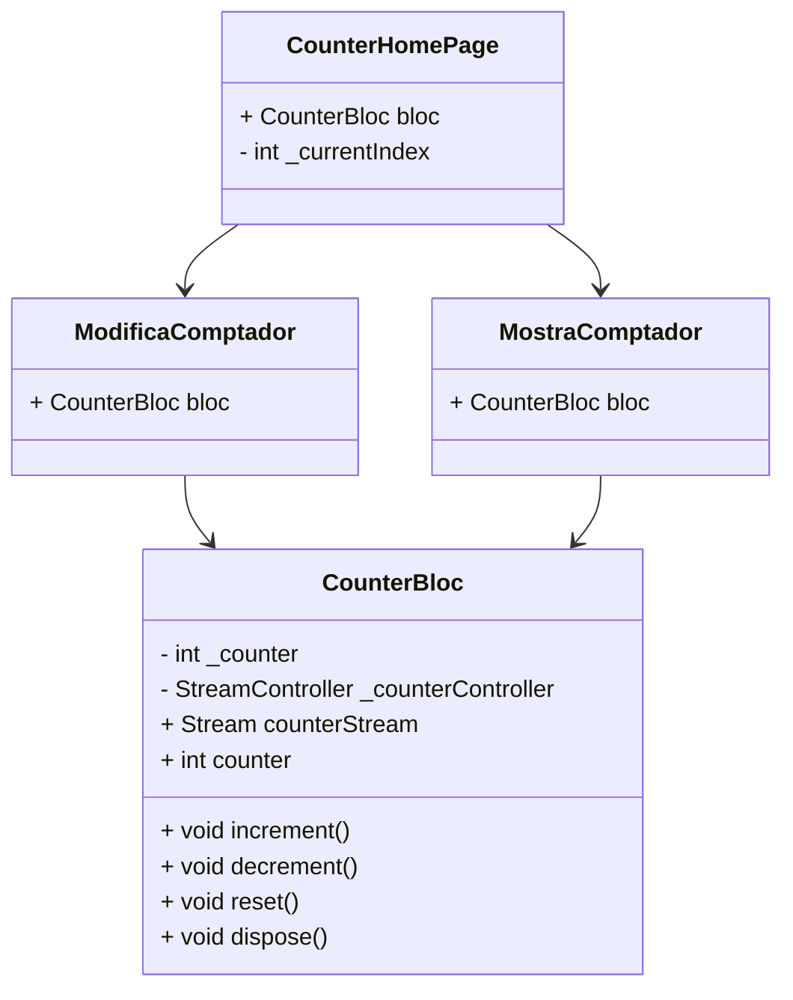
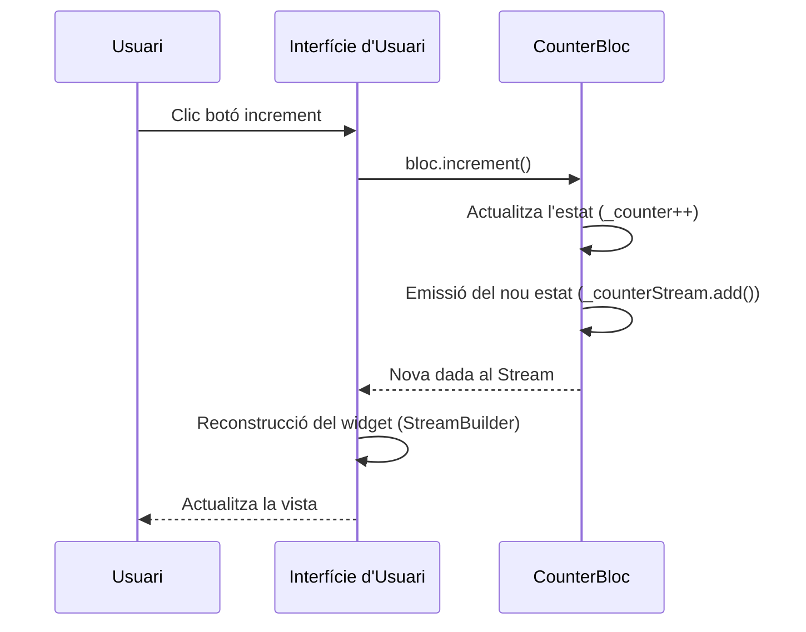

# Gestió de l'estat amb BLoC

Aquest projecte és una implementació d'un comptador utilitzant el patró **BLoC (Business Logic Component)** en Flutter. Aquesta implementació permet separar la lògica de negoci de la interfície d'usuari, fent servir **Streams** per a gestionar els canvis d'estat.

## **Funcionament**

- **CounterBloc**: Component que encapsula tota la lògica del comptador.
  - Gestiona l'estat (_counter).
  - Proporciona un `Stream` per escoltar els canvis.
  - Ofereix mètodes per modificar l'estat (`increment`, `decrement`, `reset`).
- **Singleton**: El bloc és un Singleton per assegurar que l'estat es comparteix entre totes les vistes.
- **StreamBuilder**: Els widgets utilitzen `StreamBuilder` per escoltar els canvis del bloc i reconstruir la interfície automàticament.

## **Estructura del projecte**

### **Arbre de fitxers**
```
lib/
├── bloc/
│   └── counter_bloc.dart
├── screens/
│   ├── counter_home_page.dart
│   ├── modifica_comptador.dart
│   └── mostra_comptador.dart
└── main.dart
```

### **Classes principals**

#### **CounterBloc**
- Gestiona l'estat del comptador.
- Utilitza un `StreamController` amb un `broadcast stream` per emetre canvis.
- Implementa el patró Singleton per compartir la mateixa instància entre les vistes.


#### **Pantalles**
- **`CounterHomePage`**:
  - Gestió de pestanyes amb dues vistes: `ModificaComptador` i `MostraComptador`.
- **`ModificaComptador`**:
  - Mostra el valor del comptador i proporciona botons per modificar-lo (`increment`, `decrement`, `reset`).
- **`MostraComptador`**:
  - Mostra el valor actual del comptador.



### **Flux de dades (Diagrama de Seqüència)**


