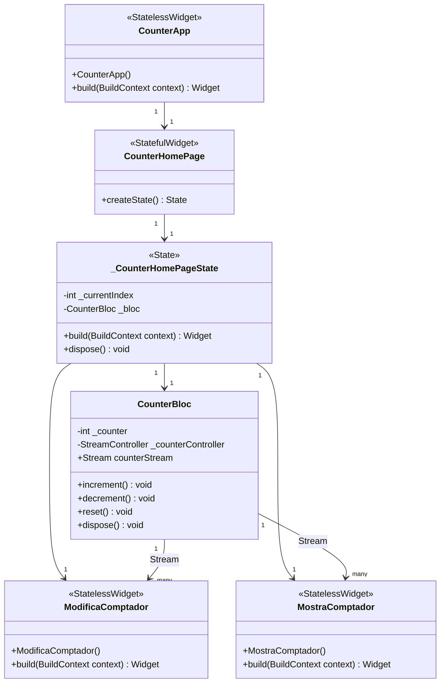
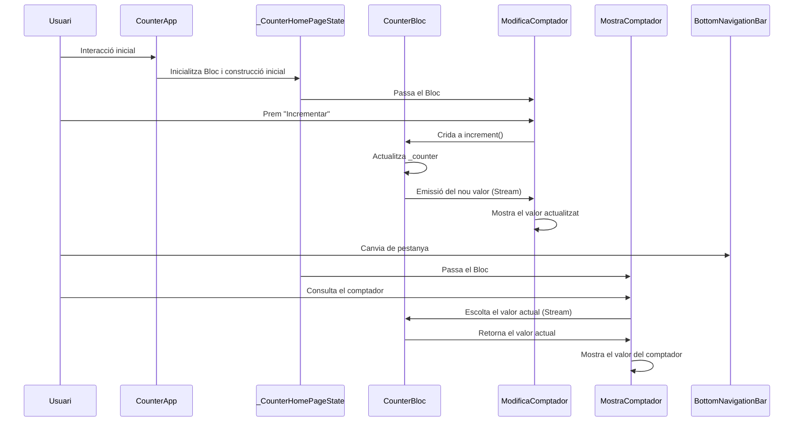

# Gestió de l'estat amb BLoC

Compartició d'estat entre components: Els patrons com Provider o Riverpod permeten compartir l'estat de forma fàcil entre diferents parts de l'aplicació, sense passar manualment les funcions o les dades.
Modularitat: La separació clara entre la lògica de l'estat i la interfície d'usuari facilita l'extracció de widgets i la reutilització.
Control granular de re-renderitzacions: Amb aquests patrons, només es reconstrueixen les parts necessàries de la interfície d'usuari, millorant així el rendiment.
Testabilitat millorada: Com que la lògica de l'estat està separada, es pot provar de forma independent de la interfície d'usuari.
Exemple pràctic de limitació amb setState
En el context del teu projecte, si vols extreure una gran part de la interfície d'usuari o necessites compartir l'estat del comptador amb més pantalles, notaràs que setState requereix molta feina manual per passar funcions i dades entre components. Amb Provider o Riverpod, aquest problema desapareix, ja que el comptador estaria disponible globalment sense dependre d'una classe concreta.

Explicació del Codi
CounterBloc:

Gestiona l'estat del comptador.
Utilitza un StreamController per emetre el valor del comptador cada vegada que canvia.
Proporciona mètodes (increment, decrement, reset) per modificar el valor del comptador i enviar-lo a través del Stream.
StreamBuilder:

S'utilitza en els widgets ModificaComptador i MostraComptador per escoltar els canvis al comptador.
Reactivament actualitza la interfície d'usuari cada vegada que el Bloc emet un nou valor.
Gestió del Bloc:

Es crea una instància de CounterBloc en la classe _CounterHomePageState.
El Bloc es passa als widgets ModificaComptador i MostraComptador mitjançant el constructor.
Disposem del Bloc al mètode dispose per alliberar recursos i evitar fuites de memòria.
Reutilització de components:

Els widgets ModificaComptador i MostraComptador són independents i reutilitzen el mateix Bloc.
Avantatges d'aquesta implementació
Separació de responsabilitats:
La lògica de l'estat es manté al Bloc, separada de la interfície d'usuari.
Reactivitat:
Qualsevol canvi al comptador es reflecteix automàticament gràcies als Streams i StreamBuilder.
Escalabilitat:
Aquesta estructura facilita afegir més funcionalitats o pantalles sense duplicar codi.

OJO !! No funciona correctament amb la segona vista

