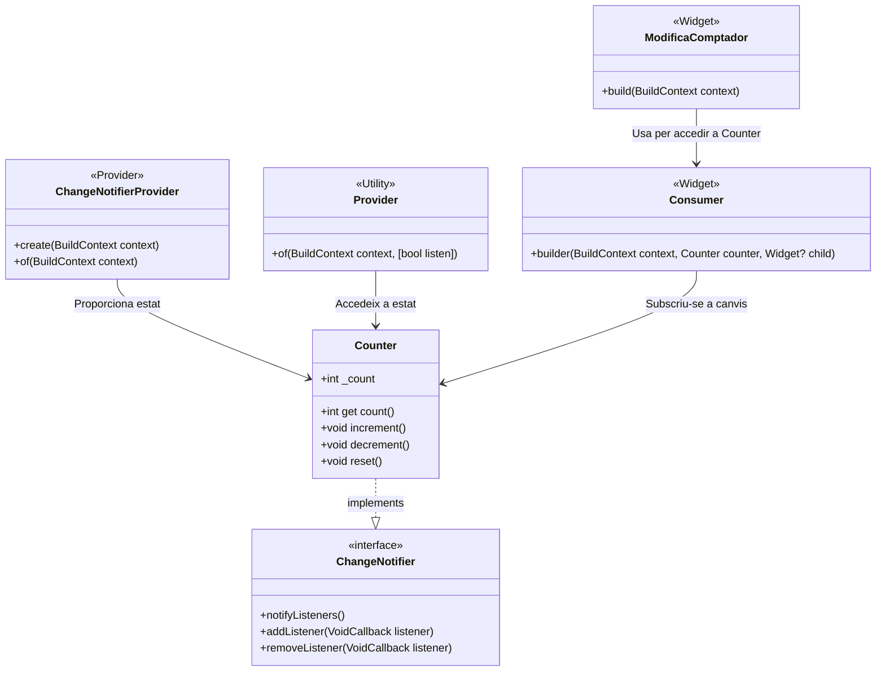
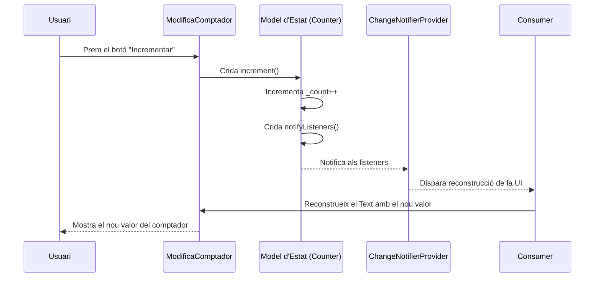

# Gestió d'Estat amb Provider

### Una alternativa més senzilla a BLoC

- **Provider** és una llibreria basada en el patró **InheritedWidget**, que simplifica la compartició d'estat entre múltiples widgets.
- És ideal per a aplicacions menudes o mitjanes que necessiten una gestió d'estat eficient.

**Avantatges:**

- Fàcil integració amb Flutter.
- Proporciona escalabilitat per a aplicacions complexes.
- Aporta menys *boilerplate* comparat amb altres patrons com BLoC.

# InheritedWidget

Els [InheritedWidgets](https://api.flutter.dev/flutter/widgets/InheritedWidget-class.html) són un tercer tipus de widgets que permeten propagar informació a través de l'arbre de widgets.

*InheritedWidget* es pot considerar també un patró de disseny que segueix el principi de proporcionar dades a través de la jerarquia de widgets en Flutter. Aquest patró es relaciona amb el [Patró Observer](https://refactoring.guru/es/design-patterns/observer), on diversos widgets (subscriptors/*Subscribers*) poden reaccionar als canvis d'un objecte central, conegut com *Subjecte*.

En aquest patró:

* **Subjecte (InheritedWidget)**: Manté dades i proporciona notificacions quan aquestes canvien. Proporciona un context als seus fills perquè puguen accedir a aquestes dades.
* **Observers (Widgets fills)**: Es registren al subjecte i són notificats quan es detecten canvis. En Flutter, [la reconstrucció dels widgets fills és la forma en què es gestionen les notificacions.](https://joamuran.net/curs24_25/pmdm/u3/3.3.CicleVida/#el-cicle-de-vida-dun-statefulwidget)


## Avantatges d'InheritedWidget

* **Propagació eficient**: Només es reconstrueixen els widgets necessaris.
* **Separació de responsabilitats**: Permet compartir dades globals sense necessitat de passar-les manualment.
* Base de Provider, que encapsula aquest mecanisme i simplifica el seu ús.

# Provider com a gestor d'estat. Punts clau

1. **Representació i provisió de l'Estat**:
   * L'estat que volem compartir es representa com un **Model d'Estat**,  implementat com una classe que utilitza `ChangeNotifier` (mixin).
     - Aquest **Model d'Estat** encapsula les dades i la lògica de negoci, aïllant-les de la interfície d'usuari (Seria l'equivalent al *BLoC* o al *ViewModel*)
   * Envoltem la UI amb un widget `Provider` o `ChangeNotifierProvider`, que comparteix aquest model amb els widgets fills.

2. **Accés a l'estat**:
   * Els widgets fills poden accedir (o millor subscriure's) al model d'estat mitjançant `Consumer` o `Provider.of`.

3. **Notificació de canvis**:
   * Quan hi ha un canvi en l'estat, el **Model d'Estat** notifica els subscriptors amb `notifyListeners`.
   * Els widgets subscrits es reconstrueixen automàticament davant aquests canvis.


# **Funcionament de Provider**


[Documentació completa](https://joamuran.net/curs24_25/pmdm/u7/7.4.Provider/)


# **Exemple: Comptador amb Provider**

### Instal·lació

```
dart pub add provider
```

### **Model d'estat**

```dart
import 'package:flutter/material.dart';

class Counter with ChangeNotifier {
  int _count = 0;
  
  int get count => _count;

  void increment() {
    _count++;
    notifyListeners(); // Notifica els listeners del canvi
  }

  void decrement() {
    _count--;
    notifyListeners();
  }

  void reset() {
    _count = 0;
    notifyListeners();
  }
}
```


# **Proveir l'estat**

* Utilitzem `ChangeNotifierProvider` per proveir l'estat als widgets fills.
   * Envoltem la classe principal (*Wrap with Widget*) amb un `ChangeNotifierProvider`
   * Aquest widget requereix del paràmetre `create`, que és una funció que instancia el model d'estat (*mixin `ChangeNotifier`*).
   * Si necessitem m'es d'un model d'estats, fem ús de [`MultiProvider`](https://pub.dev/documentation/provider/latest/provider/MultiProvider-class.html), amb una llista de Providers.

```dart
import 'package:flutter/material.dart';
import 'package:provider/provider.dart';
import 'counter.dart';

void main() {
  runApp(
    ChangeNotifierProvider(
      create: (BuildContext context) => Counter(),
      child: MyApp(),
    ),
  );
}

class MyApp extends StatelessWidget {
  @override
  Widget build(BuildContext context) {
    return MaterialApp(
      title: 'Comptador amb Provider',
      home: CounterHomePage(),
    );
  }
}
```


# **Accés a l'estat**

* Per accedir a l'estat proporionat pel Provider, podem fer ús de `Consumer` o de `Provider.of`.

## Amb `Consumer`:

* `Consumer` és la forma recomanada d'escoltar l'estat.
* `Consumer<Counter>` permet accedir a una instància del model `Counter` compartida amb `ChangeNotifierProvider`.
* Els widgets dins del bloc `builder` es reconstrueixen automàticament quan s'invoca `notifyListeners()` des del model d'estat.
* Podem proporcionar widgets que no canvien d'estat amb el paràmetre `child`, per optimitzar la reconstrucció.

```dart
Consumer<Counter>(
  builder: (context, counter, child) {
    return Text(
      'Valor del comptador: ${counter.count}',
      style: const TextStyle(fontSize: 24),
     );
  },
)
```

* Per interactuar amb l'estat, fem ús del `context`.
* Amb `context.read<Counter>()` accedim al model d'estat sense subscriure el widget als canvis (ja que només fem ús de la seua funcionalitat, però no volem que siga reactiu als canvis)

```dart
ElevatedButton(
  onPressed: () => context.read<Counter>().increment(),
  child: const Text('Incrementar'),
)
```


## Accés a l'estat amb `Provider.of`:

* Amb Provider.of obtenim una referència manual a l'estat, que podem utilitzar al llarg del widget.

```dart
final counter = Provider.of<Counter>(context);
```

* I accedim a l'estat i mètodes directament a través d'aquesta referència:

```dart
Text('Valor del comptador: ${counter.count}')
```

```dart
ElevatedButton(
  // Accedim als mètodes de la mateixa manera
  onPressed: () => counter.increment(),
  child: const Text('Incrementar'),
),
```

### Desavantatge front a Consumer

* Quan l'estat invoca a `NotifyListeners`, es redibuixa tot el widget que conté el `Provider.of`.
* Amb *Consumer* només es redibuixa la part que està al `builder`.


# Diagrames UML

## Diagrama de classes




## **Diagrama de seqüència**





