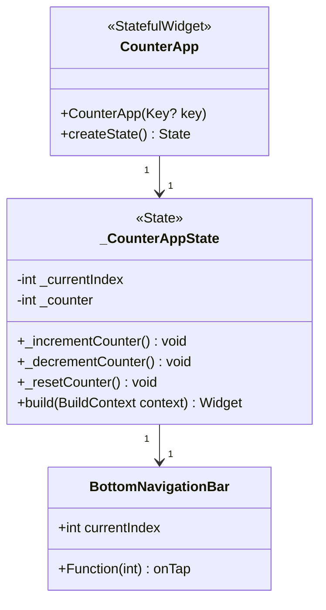
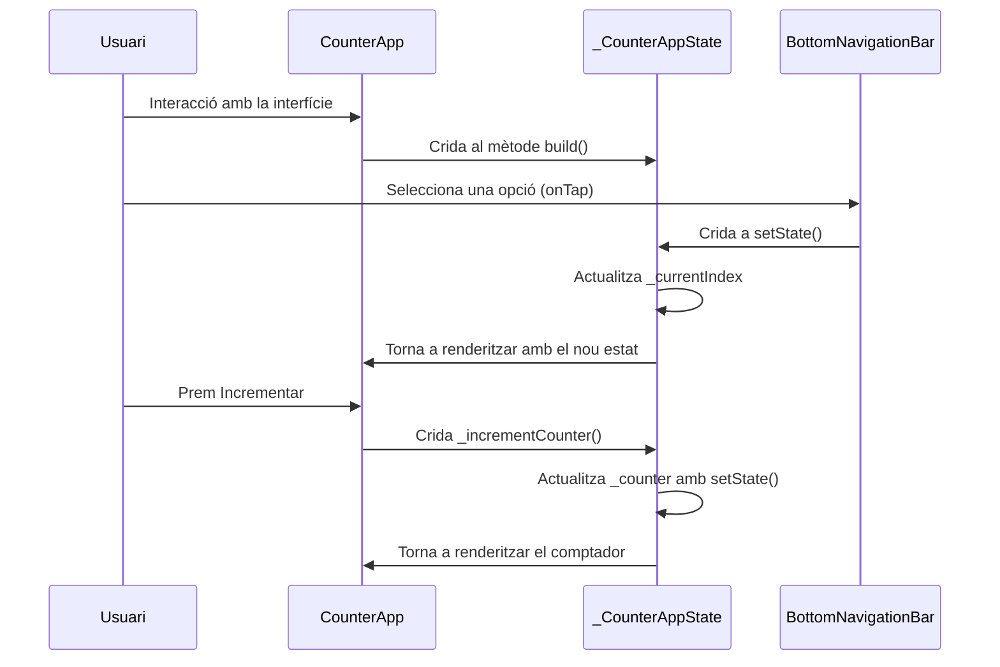

# Gestió de l'estat amb setState

## Exemple d'app comptador amb setState

En aquest exemple mostrem com gestionar l'estat del comptador mitjançant widgets amb estat i el mètode `SetState`.

Veiem el següent diagrama amb les classes més importants d'aquesta interacció:



I ara, veiem un diagrama de seqüència, on es mostra el procés de gestionar les pestanyes i incrementar el comptador, actualitzant l'estat cada vegada:




## Problemàtica i limitacions de la gestió d'estat amb setState

Si et fixes en l'estructura de la nostra solució, el mètode `build` de l'estat del widget defineix una llista de widgets per a les dues finestres:

```dart
final List<Widget> screens = [
      // Primera pantalla (editar el comptador).
      Center(...),
      // Segona pantalla (mostrar el comptador).
      Center(...),
    ];
```

Per tal de reutilitzar components, el més pràctic seria crear dos widgets nous, un per al contingut de cada pestanya.

Si ens situem en el segon *Center* i Premem `Ctrl+.`, tenim l'opció d'*extreue* el widget (*Extract Widget*) com a una classe nova.

Si extraiem el widget com a una classe nova (per exemple `MostraComptador`), aquest inclourà en el seu constructor un argument obligatori amb el valor del comptador que ha de mostrar.

```dart
class MostraComptador extends StatelessWidget {
  const Mostra({
    super.key,
    required int counter,
  }) : _counter = counter;
```

Ara bé... si intentem fer això amb el primer *Center*, VSCode ens mostrarà l'error ***Reference to an enclosing class method cannot be extracted.***

Aquest error està relacionat amb la gestió de l'estat amb `setState` i la relació amb la classe que conté l'estat. L'error fa referència a que els mètodes `_incrementCounter`, `_decrementCounter` i `resetCounter` si extraiem el widget ja no estarien accessibles perquè formen part de la classe que encapsula l'estat (`_CounterAppState`).

És a dir, els mètodes que gestionen l'estat amb `setState` només són accessibles des de la classe que hereta de `State`, no des de fora, i quan extraiem el widget, perdem la connexió amb l'estat de la classe mare.

Com veiem, aquesta és una limitació de la gestió de l'estat amb `setState`. Davant aquesta situació, tenim dues possibles solucions:

1. Fer ús de funcions de callback que passarem als nous widgets
2. Fer ús d'un gestor d'estats més avançat

A l'exemple [comptador_setstate_callbacks](../comptador_setstate_callbacks) veurem com abordar la primera solució.
