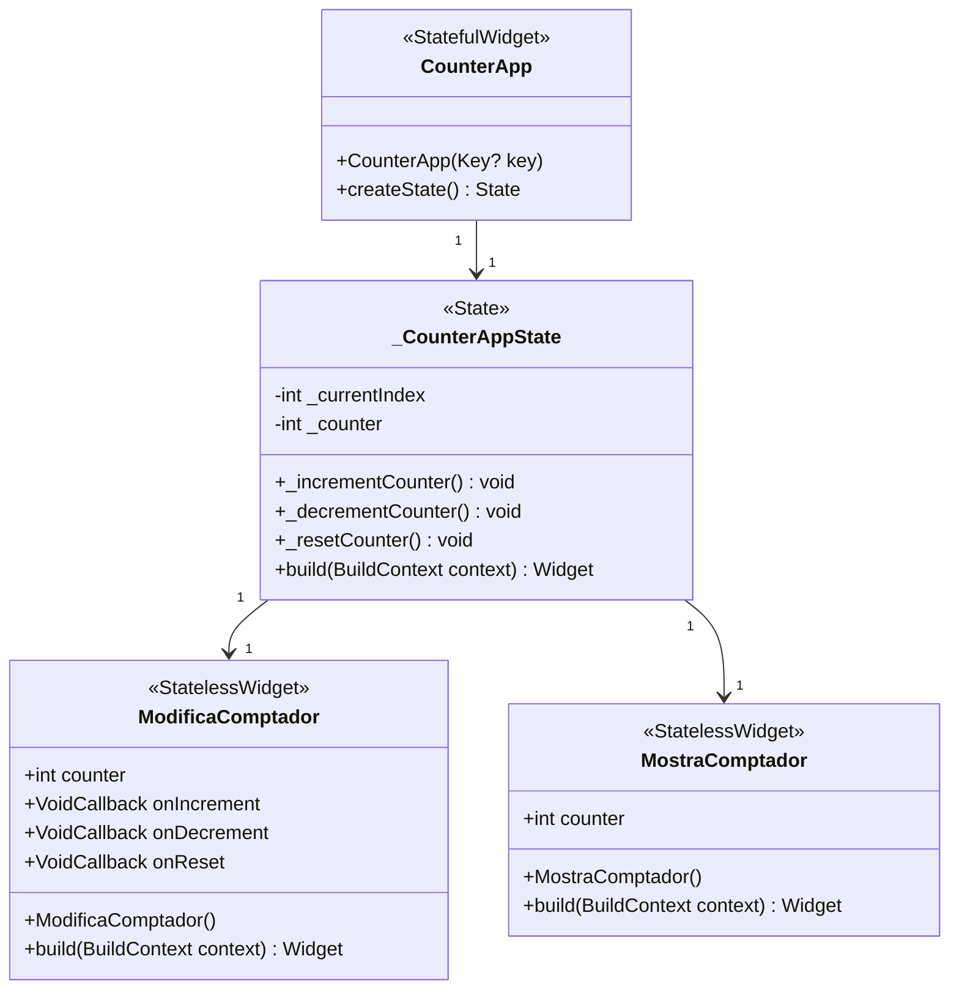
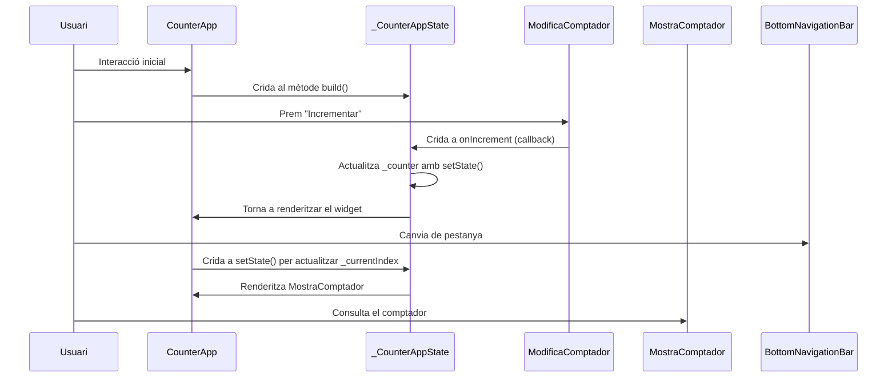

# Gestió de l'estat amb setState i ús de callbacks

Seguint amb l'exemple de la gestió de l'estat amb `setState`, la nostra intenció era convertir els components de la llista de pantalles `screens` en dos widgets:

```dart
final List<Widget> screens = [
      // Primera pantalla (editar el comptador).
      Center(...),
      // Segona pantalla (mostrar el comptador).
      Center(...),
    ];
```

Si fem `Ctrl+.` al segon i seleccionem *Extract Widget*, obtindrem una nova classe, que rebrà el valor del comptador com a argument:

```dart
class MostraComptador extends StatelessWidget {
  const MostraComptador({
    super.key,
    required int counter,
  }) : _counter = counter;

  final int _counter;

  @override
  Widget build(BuildContext context) {
    return Center(
      child: Text(
        'Comptador: $_counter',
        style: const TextStyle(fontSize: 32, fontWeight: FontWeight.bold),
      ),
    );
  }
}
```

El problema el teníem en el primer widget, que no podiem separar de la classe que conté l'estat, ja que perdriem la connexió amb aquest.

Una primera solució, serà crear aquesta classe i proporcionar-li les funcions `_incrementCounter`, `_decrementCounter`, `_resetCounter` com a paràmetres (funcions de callback), així com el valor del *comptador*, de manera que el widget nou accedisca a la lògica sense perdre la connexió amb l'estat.

Així doncs, la nova classe (`ModificaComptador`) tindrà la següent forma:

```dart
class ModificaComptador extends StatelessWidget {
  // Definim els callbacks com a VoidCallback
  final VoidCallback onIncrement;
  final VoidCallback onDecrement;
  final VoidCallback onReset;
  final int counter;

  // Constructor: Necessita els callbacks com a arguments
  const ModificaComptador({
    super.key,
    required this.counter,
    required this.onIncrement,
    required this.onDecrement,
    required this.onReset,
  });
  ...

}
```

Com veiem, definim una propietat entera per al comptador, i tres propietats més de tipus [`VoidCallback`](https://api.flutter.dev/flutter/dart-ui/VoidCallback.html), un àlies predefinit que defineix una funció que ni rep ni retorna cap argument.

El mètode build d'aquesta classe serà molt semblant al què teniem, amb la diferència que ara farà ús d'aquestes propietats, per exemple, el botó d'incrementar es definirà de la següent forma:

```dart
ElevatedButton(
  onPressed: onIncrement,
  child: const Text('Incrementar'),
)
```

De la mateixa manera s'implementen la resta de funcions i l'accés al comptador.

Ara, en la classe que conté l'estat, ja podrem crear la llista de widgets amb les dues vistes de la següent manera:

```dart
final List<Widget> screens = [
    // Primera pantalla (editar el comptador).
    ModificaComptador(
      counter: _counter,
      onIncrement: _incrementCounter,
      onDecrement: _decrementCounter,
      onReset: _resetCounter,
    ),
    // Segona pantalla (mostrar el comptador).
    MostraComptador(counter: _counter),
];
```

## Diagrama de classes

El diagrama de classes d'aquesta solució serà el següent:



## Diagrama de Seqüència

I aci veiem un possible diagrama de seqüència que il·lustra el comportament a l'hora, per exemple d'incrementar el widget.



És important destacar que quan fem clic en *Incrementar*, *Decrementar* o *Ressetejar*  el comptador, s'invoca al mètode en qüestió de la classe que conté l'estat (`_CounterAppState`), que és qui invoca a `setState` i marca tot el widget com a `dirty`, forçant que es torne a redibuixar completament en el següent frame de renderitzat.

Observeu també que ara, tant la classe `MostraComptador` com `ModificaComptador` són classes sense estat (*Stateless*).

## Limitacions

Com hem vist, la gestió de l'estat amb `setState` presenta algunes limitacions a l'hora de modularitzar el codi i extraure components. 

Quan l'estat i la seua lògica estan fortament lligats a una classe concreta (l'`StatefulWidget`), és difícil extraure parts del codi en widgets separats sense proporcionar les funcions de manera manual. Això complica la reutilització dels widgets i fa que el codi siga menys flexible i més difícil de mantenir.

D'aquesta manera, a mesura que l'aplicació creix, gestionar l'estat amb `setState` des de diversos punts de l'aplicació es torna complex i propens a errors.

A més, amb setState, quan l'estat canvia, tot el widget es reconstrueix, fins i tot les parts que no necessiten ser actualitzades, i això pot tenir un impacte negatiu en el rendiment en aplicacions grans.

A tot això, també cal afegir que quan la lògica de l'aplicació es complica, `setState` no ofereix cap suport natiu per estructurar aquesta lògica, més enllà d'actualitzacions senzilles.

La solució a tots aquests problemes passa per fer ús de patrons més avançats, com puga ser BLoC, Provider o Riverpod, desenvolupats expressament per superar aquestes limitacions.